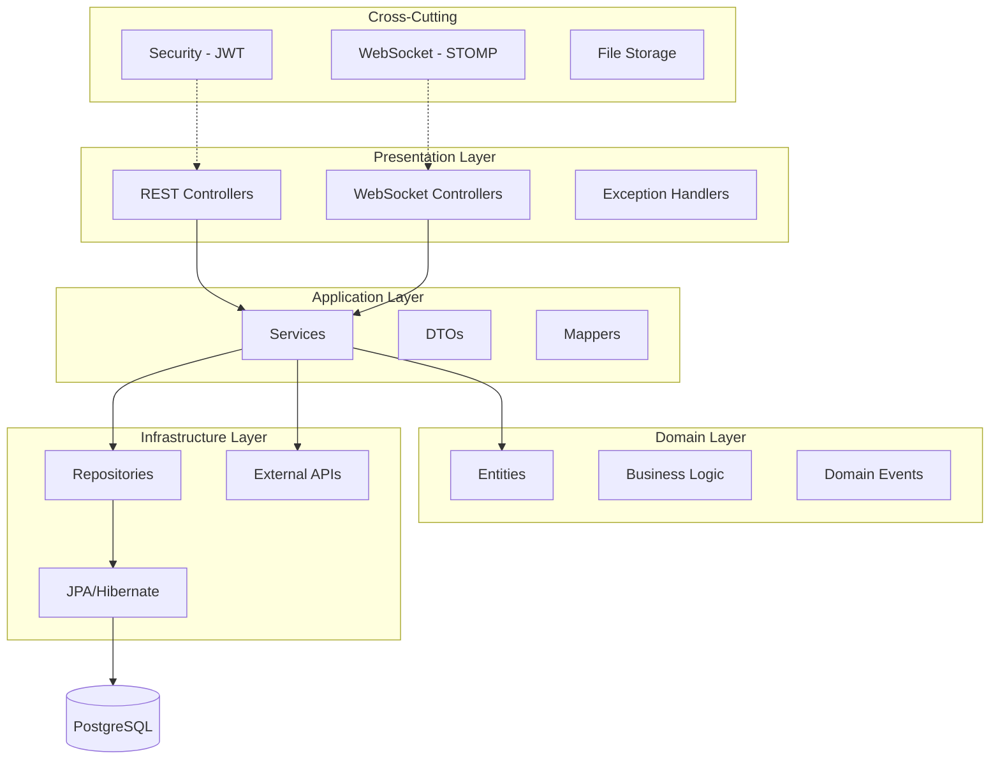
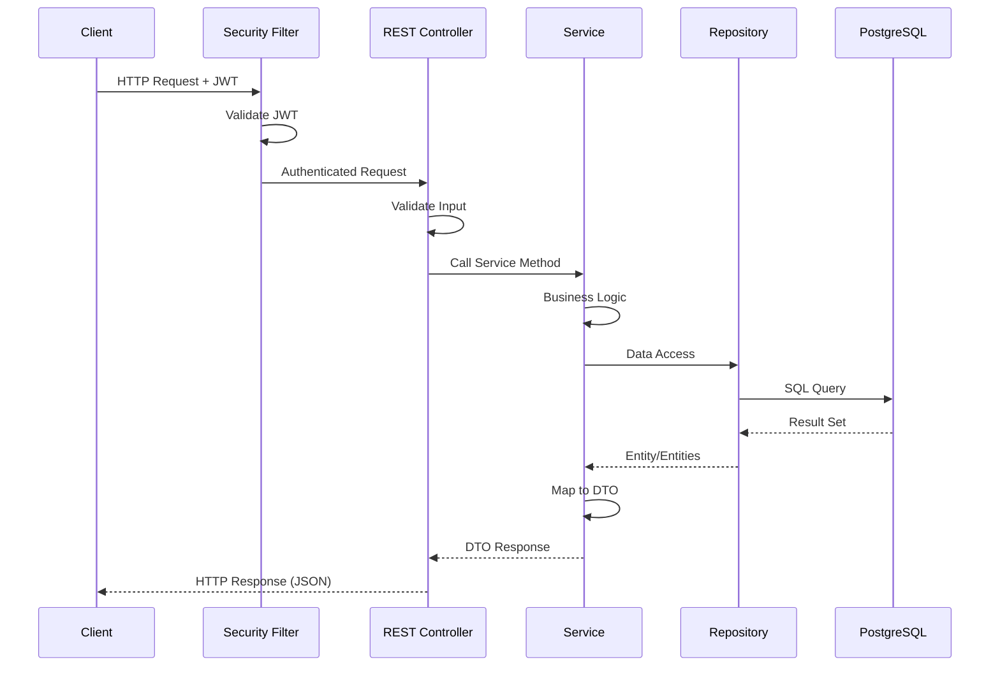
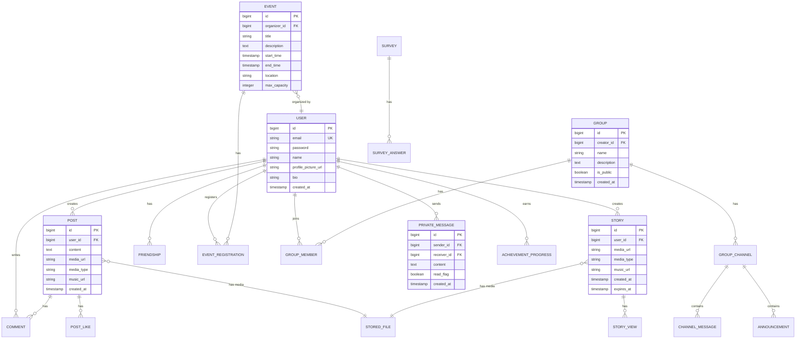
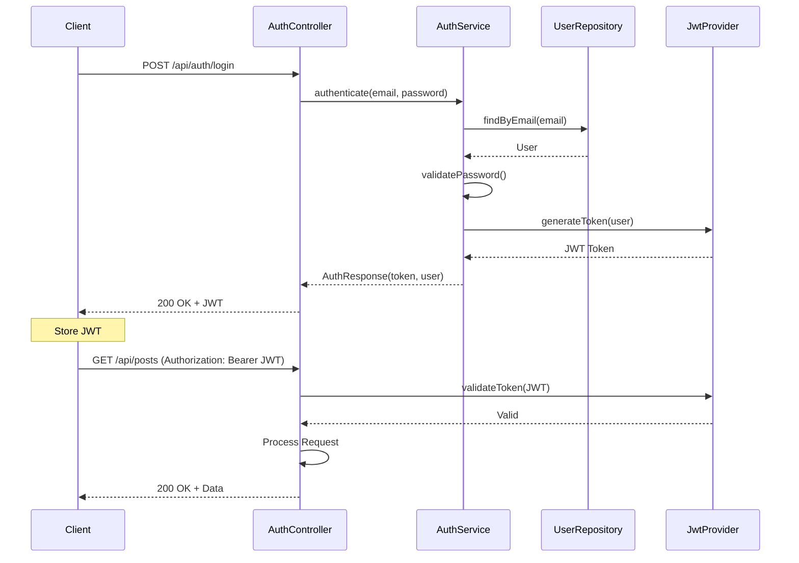

# UniVibe - Backend API Documentation


**UniVibe Backend** es una API RESTful construida con Spring Boot que proporciona todos los servicios necesarios para la plataforma social universitaria, incluyendo autenticación, gestión de eventos, grupos, chat en tiempo real, gamificación y más.

🌐 **API Base URL:** [https://univibeapp.ddns.net/api](https://univibeapp.ddns.net/api)

---

## 📋 Tabla de Contenidos

- [Descripción Técnica](#-descripción-técnica)
- [Arquitectura del Backend](#-arquitectura-del-backend)
- [Stack Tecnológico](#-stack-tecnológico)
- [Módulos y Funcionalidades](#-módulos-y-funcionalidades)
- [Modelo de Datos](#-modelo-de-datos)
- [API Endpoints](#-api-endpoints)
- [Autenticación y Seguridad](#-autenticación-y-seguridad)
- [WebSockets](#-websockets)
- [Instalación y Configuración](#-instalación-y-configuración)
- [Variables de Entorno](#-variables-de-entorno)
- [Despliegue](#-despliegue)

---

## 🎯 Descripción Técnica

El backend de **UniVibe** está construido con **Spring Boot 3.x** y **Java 17**, utilizando **PostgreSQL 16** como base de datos relacional. Implementa una arquitectura en capas (Controller → Service → Repository) siguiendo los principios de **Clean Architecture** y **Domain-Driven Design**.

La API utiliza **Spring Security** con **JWT** para autenticación, **Spring Data JPA** con **Hibernate** para persistencia, **Spring WebSocket** con **STOMP** para comunicación en tiempo real, y se integra con servicios externos como **Spotify API** y **Google Calendar API**.

---

## 🏗️ Arquitectura del Backend

### Arquitectura en Capas



### Flujo de Request/Response



---

## 🛠️ Stack Tecnológico

### Core Framework
- **Spring Boot:** 3.2.x
- **Java:** 17 (LTS)
- **Maven:** 3.9.x

### Spring Modules
- **Spring Web:** REST API
- **Spring Data JPA:** Persistencia
- **Spring Security:** Autenticación y autorización
- **Spring WebSocket:** Comunicación en tiempo real
- **Spring Validation:** Validación de datos
- **Spring Mail:** Envío de emails

### Database & ORM
- **PostgreSQL:** 16
- **Hibernate:** 6.x (ORM)
- **Flyway/Liquibase:** Migraciones (opcional)

### Security
- **JWT (JSON Web Tokens):** Autenticación stateless
- **BCrypt:** Hash de contraseñas
- **Spring Security:** Framework de seguridad

### Real-time Communication
- **SockJS:** WebSocket fallback
- **STOMP:** Messaging protocol
- **Spring WebSocket:** WebSocket support

### External Integrations
- **Spotify Web API:** Integración de música
- **Google Calendar API:** Sincronización de eventos
- **Google OAuth 2.0:** Autenticación con Google

### Utilities
- **Lombok:** Reducción de boilerplate
- **MapStruct:** Object mapping
- **Jackson:** JSON serialization
- **Apache Commons:** Utilidades

---

## 📦 Módulos y Funcionalidades

### 1. 🔐 Authentication (`auth`)
**Paquete:** `com.univibe.auth`

- Registro de usuarios
- Login con email/password
- Login con Google OAuth
- Generación y validación de JWT
- Refresh tokens
- Logout

**Endpoints principales:**
- `POST /api/auth/register`
- `POST /api/auth/login`
- `POST /api/auth/google`
- `POST /api/auth/refresh`
- `POST /api/auth/logout`

---

### 2. 👤 Users (`user`)
**Paquete:** `com.univibe.user`

- Gestión de perfiles de usuario
- Actualización de información personal
- Foto de perfil
- Búsqueda de usuarios

**Endpoints principales:**
- `GET /api/users/me`
- `GET /api/users/{id}`
- `PUT /api/users/me`
- `GET /api/users`

---

### 3. 📱 Social (`social`)
**Paquete:** `com.univibe.social`

#### Posts
- Crear, editar, eliminar publicaciones
- Likes y comentarios
- Adjuntar imágenes/videos
- Integración con Spotify

**Endpoints:**
- `GET /api/posts`
- `POST /api/posts`
- `PUT /api/posts/{id}`
- `DELETE /api/posts/{id}`
- `POST /api/posts/{id}/like`
- `GET /api/posts/{id}/comments`
- `POST /api/posts/{id}/comments`

#### Stories
- Crear stories con expiración de 24h
- Ver stories de amigos
- Marcar como visto
- Música en stories

**Endpoints:**
- `GET /api/stories`
- `POST /api/stories`
- `POST /api/stories/{id}/view`
- `DELETE /api/stories/{id}`

#### Friends
- Enviar solicitudes de amistad
- Aceptar/rechazar solicitudes
- Lista de amigos
- Recomendaciones

**Endpoints:**
- `GET /api/friends`
- `GET /api/friends/requests`
- `POST /api/friends/request/{userId}`
- `POST /api/friends/accept/{userId}`
- `POST /api/friends/reject/{userId}`
- `DELETE /api/friends/{userId}`

---

### 4. 💬 Chat (`chat`, `social/PrivateMessage`)
**Paquete:** `com.univibe.chat`, `com.univibe.social`

- Chat privado en tiempo real
- Mensajes con archivos
- Stickers
- Indicadores de lectura
- Historial de conversaciones

**REST Endpoints:**
- `GET /api/private-messages/conversations`
- `GET /api/private-messages/conversation/{userId}`
- `POST /api/private-messages/conversation/{userId}/mark-read`

**WebSocket Endpoints:**
- `/app/private.{receiverId}.send` - Enviar mensaje
- `/queue/private.{userId}` - Recibir mensajes

---

### 5. 📅 Events (`event`)
**Paquete:** `com.univibe.event`

- Crear y gestionar eventos
- Registro a eventos
- Check-in con QR
- Integración con Google Calendar
- Notificaciones de eventos

**Endpoints:**
- `GET /api/events`
- `POST /api/events`
- `GET /api/events/{id}`
- `PUT /api/events/{id}`
- `DELETE /api/events/{id}`
- `POST /api/events/{id}/register`
- `GET /api/events/registered`
- `POST /api/events/{id}/checkin`

---

### 6. 👥 Groups (`group`)
**Paquete:** `com.univibe.group`

- Crear grupos públicos/privados
- Gestión de miembros
- Roles (Admin, Moderador, Miembro)
- Canales de comunicación
- Anuncios
- Encuestas

**Endpoints:**
- `GET /api/groups`
- `POST /api/groups`
- `GET /api/groups/{id}`
- `POST /api/groups/{id}/join`
- `POST /api/groups/{id}/leave`
- `GET /api/groups/{id}/members`
- `GET /api/groups/{groupId}/channel/messages`
- `POST /api/groups/{groupId}/channel/messages`
- `GET /api/groups/{groupId}/channel/announcements`
- `POST /api/groups/{groupId}/channel/announcements`

---

### 7. 🏆 Gamification (`gamification`)
**Paquete:** `com.univibe.gamification`

- Sistema de logros
- Puntos por actividades
- Badges
- Leaderboard
- Eventos de dominio para tracking

**Endpoints:**
- `GET /api/achievements/my`
- `GET /api/achievements/all`
- `GET /api/achievements/stats`

---

### 8. 🔔 Notifications (`notification`)
**Paquete:** `com.univibe.notification`

- Notificaciones en tiempo real
- Push notifications
- Notificaciones por email
- Preferencias de notificación

**REST Endpoints:**
- `GET /api/notifications/{userId}`

**WebSocket:**
- `/queue/notifications.{userId}` - Recibir notificaciones

---

### 9. 📞 Calls (`call`)
**Paquete:** `com.univibe.call`

- Llamadas de voz/video (WebRTC signaling)
- Gestión de llamadas activas
- Señalización para peer-to-peer

**Endpoints:**
- `GET /api/calls/active`
- WebSocket para señalización

---

### 10. 📊 Surveys (`survey`)
**Paquete:** `com.univibe.survey`

- Crear encuestas
- Responder encuestas
- Ver resultados
- Encuestas en grupos

**Endpoints:**
- `GET /api/surveys`
- `POST /api/surveys`
- `GET /api/surveys/{id}`
- `POST /api/surveys/{id}/answer`
- `GET /api/surveys/{id}/answers`

---

### 11. 🎵 Spotify Integration (`integration/spotify`)
**Paquete:** `com.univibe.integration.spotify`

- Búsqueda de canciones
- Información de tracks
- Preview de canciones

**Endpoints:**
- `GET /api/spotify/search?q={query}`
- `GET /api/spotify/tracks/{trackId}`

---

### 12. 📆 Google Calendar Integration (`integration/googlecalendar`)
**Paquete:** `com.univibe.integration.googlecalendar`

- Sincronización de eventos
- OAuth con Google
- Creación automática de eventos

**Endpoints:**
- `GET /api/integration/googlecalendar/auth`
- `POST /api/integration/googlecalendar/sync`

---

### 13. 📁 File Management (`media`)
**Paquete:** `com.univibe.media`

- Upload de archivos
- Almacenamiento de imágenes/videos
- Generación de thumbnails
- Gestión de permisos

**Endpoints:**
- `POST /api/files/upload`
- `GET /api/files/{id}`
- `DELETE /api/files/{id}`

---

### 14. 🎭 Stickers (`sticker`)
**Paquete:** `com.univibe.sticker`

- Catálogo de stickers
- Stickers en chat
- Packs de stickers

**Endpoints:**
- `GET /api/stickers`

---

### 15. 🆘 Support (`support`)
**Paquete:** `com.univibe.support`

- Sistema de tickets
- Soporte técnico
- FAQ

**Endpoints:**
- `GET /api/support/tickets/my`
- `POST /api/support/tickets`
- `GET /api/support/tickets/{id}`

---

## 🗄️ Modelo de Datos

### Diagrama ER Principal



### Entidades Principales

#### User
```java
@Entity
@Table(name = "users")
public class User {
    @Id @GeneratedValue
    private Long id;
    
    @Column(unique = true, nullable = false)
    private String email;
    
    @Column(nullable = false)
    private String password;
    
    private String name;
    private String profilePictureUrl;
    private String bio;
    
    @CreationTimestamp
    private LocalDateTime createdAt;
    
    @OneToMany(mappedBy = "user")
    private List<Post> posts;
    
    @OneToMany(mappedBy = "user")
    private List<Story> stories;
    
    // ... más relaciones
}
```

#### Post
```java
@Entity
@Table(name = "posts")
public class Post {
    @Id @GeneratedValue
    private Long id;
    
    @ManyToOne
    @JoinColumn(name = "user_id")
    private User user;
    
    @Column(columnDefinition = "TEXT")
    private String content;
    
    private String mediaUrl;
    private String mediaType; // IMAGE, VIDEO
    private String musicUrl; // Spotify URL
    
    @CreationTimestamp
    private LocalDateTime createdAt;
    
    @OneToMany(mappedBy = "post", cascade = CascadeType.ALL)
    private List<Comment> comments;
    
    @OneToMany(mappedBy = "post", cascade = CascadeType.ALL)
    private List<PostLike> likes;
}
```

#### Event
```java
@Entity
@Table(name = "events")
public class Event {
    @Id @GeneratedValue
    private Long id;
    
    @ManyToOne
    @JoinColumn(name = "organizer_id")
    private User organizer;
    
    private String title;
    
    @Column(columnDefinition = "TEXT")
    private String description;
    
    private LocalDateTime startTime;
    private LocalDateTime endTime;
    private String location;
    private String imageUrl;
    private Integer maxCapacity;
    
    @OneToMany(mappedBy = "event")
    private List<EventRegistration> registrations;
}
```

---

## 🔌 API Endpoints

### Resumen de Endpoints por Módulo

| Módulo | Base Path | Endpoints | Descripción |
|--------|-----------|-----------|-------------|
| Auth | `/api/auth` | 5 | Autenticación y registro |
| Users | `/api/users` | 4 | Gestión de usuarios |
| Posts | `/api/posts` | 8 | Publicaciones sociales |
| Stories | `/api/stories` | 4 | Historias temporales |
| Friends | `/api/friends` | 6 | Red de amigos |
| Events | `/api/events` | 10 | Eventos universitarios |
| Groups | `/api/groups` | 15+ | Grupos y canales |
| Chat | `/api/private-messages` | 3 | Mensajes privados |
| Notifications | `/api/notifications` | 1 | Notificaciones |
| Achievements | `/api/achievements` | 3 | Gamificación |
| Spotify | `/api/spotify` | 2 | Integración Spotify |
| Files | `/api/files` | 3 | Gestión de archivos |
| Support | `/api/support` | 3 | Soporte técnico |

### Ejemplos de Endpoints Detallados

#### Authentication

```http
POST /api/auth/register
Content-Type: application/json

{
  "name": "Juan Pérez",
  "email": "juan@universidad.edu",
  "password": "SecurePass123!"
}

Response: 201 Created
{
  "token": "eyJhbGciOiJIUzI1NiIs...",
  "user": {
    "id": 1,
    "name": "Juan Pérez",
    "email": "juan@universidad.edu"
  }
}
```

```http
POST /api/auth/login
Content-Type: application/json

{
  "email": "juan@universidad.edu",
  "password": "SecurePass123!"
}

Response: 200 OK
{
  "token": "eyJhbGciOiJIUzI1NiIs...",
  "user": { ... }
}
```

#### Posts

```http
GET /api/posts?page=0&size=10
Authorization: Bearer {token}

Response: 200 OK
{
  "content": [
    {
      "id": 1,
      "user": {
        "id": 1,
        "name": "Juan Pérez",
        "profilePictureUrl": "https://..."
      },
      "content": "¡Hola UniVibe!",
      "mediaUrl": "https://...",
      "musicUrl": "spotify:track:...",
      "createdAt": "2024-01-15T10:30:00",
      "likesCount": 42,
      "commentsCount": 5,
      "isLiked": false
    }
  ],
  "totalPages": 10,
  "totalElements": 95
}
```

```http
POST /api/posts
Authorization: Bearer {token}
Content-Type: application/json

{
  "content": "Mi primera publicación",
  "mediaUrl": "https://...",
  "mediaType": "IMAGE",
  "musicUrl": "spotify:track:3n3Ppam7vgaVa1iaRUc9Lp"
}

Response: 201 Created
{
  "id": 123,
  "user": { ... },
  "content": "Mi primera publicación",
  ...
}
```

#### Events

```http
POST /api/events
Authorization: Bearer {token}
Content-Type: application/json

{
  "title": "Hackathon 2024",
  "description": "Competencia de programación",
  "startTime": "2024-03-15T09:00:00",
  "endTime": "2024-03-15T18:00:00",
  "location": "Auditorio Principal",
  "maxCapacity": 100
}

Response: 201 Created
```

```http
POST /api/events/{eventId}/register
Authorization: Bearer {token}

Response: 200 OK
{
  "message": "Registered successfully",
  "qrCode": "data:image/png;base64,..."
}
```

---

## 🔐 Autenticación y Seguridad

### JWT (JSON Web Tokens)

El backend utiliza JWT para autenticación stateless:

```java
@Component
public class JwtTokenProvider {
    
    @Value("${security.jwt.secret}")
    private String jwtSecret;
    
    @Value("${security.jwt.expiration}")
    private long jwtExpiration;
    
    public String generateToken(Authentication authentication) {
        UserDetails userDetails = (UserDetails) authentication.getPrincipal();
        Date now = new Date();
        Date expiryDate = new Date(now.getTime() + jwtExpiration);
        
        return Jwts.builder()
            .setSubject(userDetails.getUsername())
            .setIssuedAt(now)
            .setExpiration(expiryDate)
            .signWith(SignatureAlgorithm.HS512, jwtSecret)
            .compact();
    }
}
```

### Flujo de Autenticación



### Security Configuration

```java
@Configuration
@EnableWebSecurity
public class SecurityConfig {
    
    @Bean
    public SecurityFilterChain filterChain(HttpSecurity http) throws Exception {
        http
            .csrf().disable()
            .cors()
            .and()
            .sessionManagement()
                .sessionCreationPolicy(SessionCreationPolicy.STATELESS)
            .and()
            .authorizeHttpRequests()
                .requestMatchers("/api/auth/**").permitAll()
                .requestMatchers("/api/health").permitAll()
                .requestMatchers("/ws/**").permitAll()
                .anyRequest().authenticated()
            .and()
            .addFilterBefore(jwtAuthenticationFilter(), 
                UsernamePasswordAuthenticationFilter.class);
        
        return http.build();
    }
}
```

### Roles y Permisos

```java
public enum Role {
    USER,           // Usuario regular
    ADMIN,          // Administrador del sistema
    MODERATOR,      // Moderador de contenido
    GROUP_ADMIN,    // Administrador de grupo
    GROUP_MODERATOR // Moderador de grupo
}
```

---

## 🔌 WebSockets

### Configuración STOMP

```java
@Configuration
@EnableWebSocketMessageBroker
public class WebSocketConfig implements WebSocketMessageBrokerConfigurer {
    
    @Override
    public void configureMessageBroker(MessageBrokerRegistry config) {
        config.enableSimpleBroker("/queue", "/topic");
        config.setApplicationDestinationPrefixes("/app");
    }
    
    @Override
    public void registerStompEndpoints(StompEndpointRegistry registry) {
        registry.addEndpoint("/ws")
            .setAllowedOrigins("*")
            .withSockJS();
    }
}
```

### Endpoints WebSocket

#### Chat Privado

**Enviar mensaje:**
```
SEND /app/private.{receiverId}.send
{
  "content": "Hola!",
  "fileId": null,
  "stickerId": null
}
```

**Recibir mensajes:**
```
SUBSCRIBE /queue/private.{userId}
```

#### Notificaciones

**Recibir notificaciones:**
```
SUBSCRIBE /queue/notifications.{userId}
```

#### Presencia (Online/Offline)

**Actualizar estado:**
```
SEND /app/presence/status
{
  "status": "ONLINE"
}
```

**Suscribirse a estado de usuario:**
```
SUBSCRIBE /queue/presence.{userId}
```

---

## 🚀 Instalación y Configuración

### Requisitos Previos

- **Java:** 17 o superior
- **Maven:** 3.9.x
- **PostgreSQL:** 16
- **Docker:** (opcional)

### Configuración Local

#### 1. Clonar Repositorio

```bash
git clone https://github.com/tu-usuario/univibe.git
cd univibe/backend
```

#### 2. Configurar Base de Datos

Crear base de datos PostgreSQL:

```sql
CREATE DATABASE univibe;
CREATE USER univibe_user WITH PASSWORD 'your_password';
GRANT ALL PRIVILEGES ON DATABASE univibe TO univibe_user;
```

#### 3. Configurar Variables de Entorno

Copiar archivo de ejemplo:

```bash
cp .env.example .env
```

Editar `.env` con tus credenciales:

```env
# Database
SPRING_DATASOURCE_URL=jdbc:postgresql://localhost:5432/univibe
SPRING_DATASOURCE_USERNAME=univibe_user
SPRING_DATASOURCE_PASSWORD=your_password

# JWT
SECURITY_JWT_SECRET=your_very_long_secret_key_minimum_64_characters_for_hs512

# Spotify
SPOTIFY_CLIENT_ID=your_spotify_client_id
SPOTIFY_CLIENT_SECRET=your_spotify_client_secret

# Google
GOOGLE_CLIENT_ID=your_google_client_id
GOOGLE_CLIENT_SECRET=your_google_client_secret

# Email
MAIL_HOST=smtp.gmail.com
MAIL_PORT=587
MAIL_USERNAME=your_email@gmail.com
MAIL_PASSWORD=your_app_password
```

#### 4. Ejecutar Aplicación

**Con Maven:**

```bash
./mvnw spring-boot:run
```

**Con Docker:**

```bash
docker-compose up backend
```

La API estará disponible en: **http://localhost:8080**

#### 5. Verificar

```bash
curl http://localhost:8080/api/health
```

Respuesta esperada:
```json
{
  "status": "UP",
  "message": "UniVibe API is running"
}
```

---

## 🔧 Variables de Entorno

### Database

| Variable | Descripción | Ejemplo |
|----------|-------------|---------|
| `SPRING_DATASOURCE_URL` | URL de PostgreSQL | `jdbc:postgresql://localhost:5432/univibe` |
| `SPRING_DATASOURCE_USERNAME` | Usuario de DB | `univibe_user` |
| `SPRING_DATASOURCE_PASSWORD` | Contraseña de DB | `secure_password` |

### Security

| Variable | Descripción | Requerido |
|----------|-------------|-----------|
| `SECURITY_JWT_SECRET` | Secret para JWT (min 64 chars) | ✅ |
| `SECURITY_JWT_EXPIRATION` | Expiración en ms | ❌ (default: 86400000) |

### External APIs

| Variable | Descripción |
|----------|-------------|
| `SPOTIFY_CLIENT_ID` | Client ID de Spotify |
| `SPOTIFY_CLIENT_SECRET` | Client Secret de Spotify |
| `SPOTIFY_REDIRECT_URI` | Redirect URI |
| `GOOGLE_CLIENT_ID` | Client ID de Google OAuth |
| `GOOGLE_CLIENT_SECRET` | Client Secret de Google |
| `GOOGLE_CALENDAR_ACCESS_TOKEN` | Access token de Calendar |

### Email

| Variable | Descripción |
|----------|-------------|
| `MAIL_HOST` | Servidor SMTP |
| `MAIL_PORT` | Puerto SMTP |
| `MAIL_USERNAME` | Usuario de email |
| `MAIL_PASSWORD` | Contraseña de email |

### CORS

| Variable | Descripción | Ejemplo |
|----------|-------------|---------|
| `CORS_ALLOWED_ORIGINS` | Orígenes permitidos | `http://localhost:5173,https://univibeapp.ddns.net` |

---

## 📊 Estructura del Proyecto

```
backend/
├── src/
│   ├── main/
│   │   ├── java/com/univibe/
│   │   │   ├── auth/                    # Autenticación
│   │   │   │   ├── dto/
│   │   │   │   ├── service/
│   │   │   │   └── AuthController.java
│   │   │   ├── user/                    # Usuarios
│   │   │   │   ├── model/
│   │   │   │   ├── repo/
│   │   │   │   ├── service/
│   │   │   │   └── web/
│   │   │   ├── social/                  # Social (Posts, Stories, Friends)
│   │   │   │   ├── model/
│   │   │   │   ├── repo/
│   │   │   │   ├── dto/
│   │   │   │   ├── service/
│   │   │   │   └── web/
│   │   │   ├── event/                   # Eventos
│   │   │   ├── group/                   # Grupos
│   │   │   ├── chat/                    # Chat
│   │   │   ├── notification/            # Notificaciones
│   │   │   ├── gamification/            # Gamificación
│   │   │   ├── integration/             # Integraciones externas
│   │   │   │   ├── spotify/
│   │   │   │   └── googlecalendar/
│   │   │   ├── media/                   # Gestión de archivos
│   │   │   ├── security/                # Seguridad (JWT, Filters)
│   │   │   ├── config/                  # Configuraciones
│   │   │   │   ├── SecurityConfig.java
│   │   │   │   ├── WebSocketConfig.java
│   │   │   │   └── CorsConfig.java
│   │   │   ├── common/                  # DTOs y utilidades comunes
│   │   │   └── UniVibeApplication.java  # Main class
│   │   └── resources/
│   │       ├── application.properties
│   │       └── application-prod.properties
│   └── test/                            # Tests
├── .env.example                         # Template de variables
├── Dockerfile
├── pom.xml                              # Maven dependencies
└── README.md
```

---

## 🐳 Despliegue

### Docker

**Dockerfile:**

```dockerfile
FROM maven:3.9-eclipse-temurin-17 AS build
WORKDIR /app
COPY pom.xml .
COPY src ./src
RUN mvn clean package -DskipTests

FROM eclipse-temurin:17-jre
WORKDIR /app
COPY --from=build /app/target/*.jar app.jar
EXPOSE 8080
ENTRYPOINT ["java", "-jar", "app.jar"]
```

**Build y Run:**

```bash
# Build
docker build -t univibe-backend .

# Run
docker run -p 8080:8080 --env-file .env univibe-backend
```

### Docker Compose

```yaml
version: '3.8'

services:
  db:
    image: postgres:16
    environment:
      POSTGRES_DB: ${POSTGRES_DB}
      POSTGRES_USER: ${POSTGRES_USER}
      POSTGRES_PASSWORD: ${POSTGRES_PASSWORD}
    volumes:
      - postgres_data:/var/lib/postgresql/data
    ports:
      - "5432:5432"

  backend:
    build: ./backend
    env_file:
      - ./backend/.env
    ports:
      - "8080:8080"
    depends_on:
      - db

volumes:
  postgres_data:
```

### AWS Deployment

Ver [READMEFRONT.md](../frontend/web/READMEFRONT.md) para detalles de despliegue completo en AWS.

---

## 📝 Logging

### Configuración de Logs

```properties
# application.properties
logging.level.root=INFO
logging.level.com.univibe=DEBUG
logging.level.org.springframework.web=DEBUG
logging.level.org.hibernate.SQL=DEBUG
logging.pattern.console=%d{yyyy-MM-dd HH:mm:ss} - %msg%n
```

### Logs Importantes

- **SQL Queries:** `org.hibernate.SQL=DEBUG`
- **Security:** `org.springframework.security=DEBUG`
- **WebSocket:** `org.springframework.messaging=DEBUG`

---

## 🧪 Testing

```bash
# Run all tests
./mvnw test

# Run specific test
./mvnw test -Dtest=UserServiceTest

# Run with coverage
./mvnw test jacoco:report
```

---

## 📚 Documentación API

### Swagger/OpenAPI

Acceder a la documentación interactiva:

**URL:** `http://localhost:8080/swagger-ui.html`

### Postman Collection

Importar colección de Postman incluida en: `/docs/postman/UniVibe.postman_collection.json`

---

## 🔍 Troubleshooting

### Base de datos no conecta

```bash
# Verificar que PostgreSQL esté corriendo
docker ps | grep postgres

# Verificar logs
docker logs univibe-db
```

### JWT inválido

- Verificar que `SECURITY_JWT_SECRET` tenga al menos 64 caracteres
- Verificar que el token no haya expirado

### WebSocket no conecta

- Verificar configuración de CORS
- Verificar que SockJS esté habilitado
- Revisar logs de WebSocket

---

## 📄 Licencia

Este proyecto es privado y confidencial.

---

## 👥 Equipo de Desarrollo

Backend desarrollado por el equipo de UniVibe.

---

## 🔗 Links Relacionados

- **Frontend Documentation:** [READMEFRONT.md](../frontend/web/READMEFRONT.md)
- **API Base URL:** https://univibeapp.ddns.net/api
- **Swagger Docs:** https://univibeapp.ddns.net/api/docs

---

**¿Preguntas sobre el backend?** Contacta al equipo de desarrollo.
