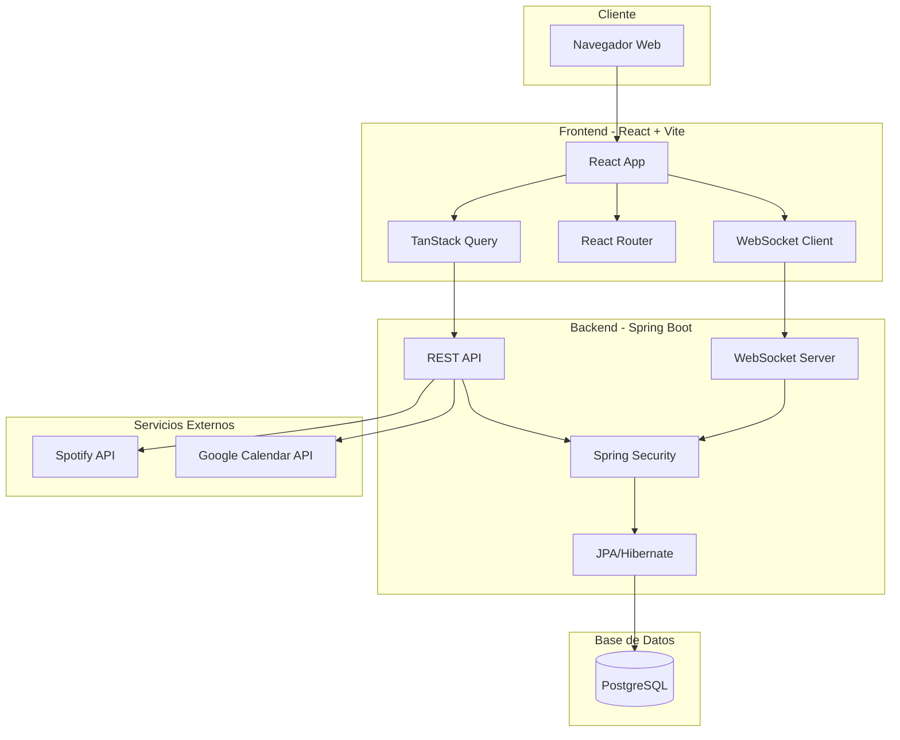
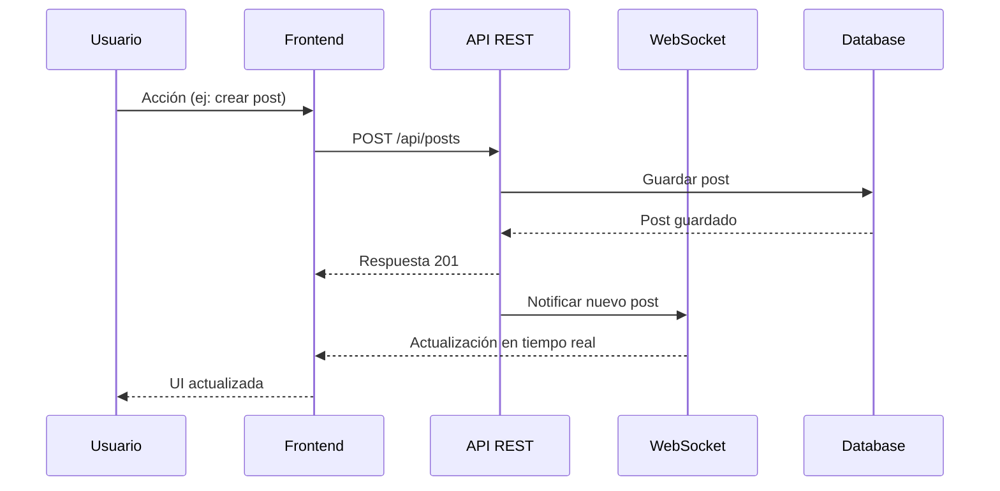

# UniVibe - Frontend Web


**UniVibe** es una plataforma social universitaria completa que conecta estudiantes a través de eventos, grupos, publicaciones y chat en tiempo real.

🌐 **Aplicación desplegada:** [https://univibeapp.ddns.net](https://univibeapp.ddns.net)

---

## 📋 Tabla de Contenidos

- [Descripción Técnica](#-descripción-técnica)
- [Arquitectura del Sistema](#-arquitectura-del-sistema)
- [Stack Tecnológico](#-stack-tecnológico)
- [Características Principales](#-características-principales)
- [Requisitos Previos](#-requisitos-previos)
- [Instalación y Configuración](#-instalación-y-configuración)
- [Estructura del Proyecto](#-estructura-del-proyecto)
- [Despliegue](#-despliegue)
- [Variables de Entorno](#-variables-de-entorno)

---

## 🎯 Descripción Técnica

**UniVibe** utiliza **React con TypeScript** para el frontend, **Spring Boot** para el backend, **PostgreSQL** como base de datos y está completamente hosteada en **AWS**. Adicionalmente, usamos **WebSockets (SockJS/STOMP)** para funcionalidades en tiempo real como chat, notificaciones y actualizaciones de eventos.

El frontend está construido con **Vite** para un desarrollo rápido y optimizado, utiliza **TanStack Query** para gestión de estado del servidor, **React Router** para navegación, y **Tailwind CSS** para estilos. La aplicación soporta temas claro/oscuro y es completamente responsive.

---

## 🏗️ Arquitectura del Sistema



### Flujo de Datos



---

## 🛠️ Stack Tecnológico

### Frontend
- **Framework:** React 18 + TypeScript
- **Build Tool:** Vite 5
- **Routing:** React Router v6
- **State Management:** 
  - TanStack Query (React Query) - Server state
  - Context API - Client state
- **Styling:** Tailwind CSS
- **HTTP Client:** Axios
- **WebSockets:** SockJS + STOMP
- **Forms:** React Hook Form
- **Notifications:** React Hot Toast

### Backend
- **Framework:** Spring Boot 3.x
- **Language:** Java 17
- **Database:** PostgreSQL 16
- **ORM:** Spring Data JPA / Hibernate
- **Security:** Spring Security + JWT
- **WebSockets:** Spring WebSocket + STOMP
- **Real-time:** SockJS

### DevOps & Deployment
- **Containerization:** Docker + Docker Compose
- **Hosting:** AWS EC2
- **Reverse Proxy:** Nginx
- **SSL:** Let's Encrypt
- **DNS:** No-IP (univibeapp.ddns.net)

---

## ✨ Características Principales

### 🔐 Autenticación y Seguridad
- Login/Register con JWT
- Autenticación con Google OAuth
- Sesiones persistentes
- Protección de rutas

### 📱 Social
- **Posts:** Crear, editar, eliminar publicaciones
- **Stories:** Historias con expiración de 24h
- **Likes y Comentarios:** Interacción en tiempo real
- **Música:** Integración con Spotify en posts y stories
- **Amigos:** Sistema de solicitudes de amistad

### 📅 Eventos
- Crear y gestionar eventos universitarios
- Registro a eventos
- Check-in con código QR
- Integración con Google Calendar
- Notificaciones de eventos

### 👥 Grupos
- Crear grupos públicos/privados
- Canales de comunicación
- Anuncios del grupo
- Roles (Admin, Moderador, Miembro)
- Encuestas dentro de grupos

### 💬 Chat
- Chat privado en tiempo real
- Mensajes con archivos adjuntos
- Stickers
- Indicadores de lectura
- Notificaciones push

### 🏆 Gamificación
- Sistema de logros
- Puntos por actividades
- Badges y recompensas
- Leaderboard

### 🎨 Personalización
- Tema claro/oscuro
- Paleta de colores personalizable
- Preferencias de usuario

---

## 📦 Requisitos Previos

Antes de comenzar, asegúrate de tener instalado:

- **Node.js** >= 18.x
- **npm** >= 9.x o **yarn** >= 1.22.x
- **Docker** >= 24.x
- **Docker Compose** >= 2.x
- **Git**

---

## 🚀 Instalación y Configuración

### Opción 1: Desarrollo Local (Recomendado)

#### 1. Clonar el Repositorio

```bash
git clone https://github.com/tu-usuario/univibe.git
cd univibe
```

#### 2. Configurar Variables de Entorno

**Frontend (`frontend/web/.env`):**
```bash
cp frontend/web/.env.example frontend/web/.env
```

Editar `frontend/web/.env`:
```env
VITE_API_BASE_URL=http://localhost:8080
VITE_WS_BASE_URL=http://localhost:8080
VITE_GOOGLE_CLIENT_ID=tu_google_client_id
```

**Backend (`backend/.env`):**
```bash
cp backend/.env.example backend/.env
```

Editar `backend/.env` con tus credenciales de:
- PostgreSQL
- JWT Secret
- Spotify API
- Google OAuth
- Email SMTP

**Root (`.env`):**
```bash
cp .env.example .env
```

#### 3. Levantar con Docker Compose

**IMPORTANTE:** El Docker Compose del frontend importa el backend y corre todo en una sola instancia.

```bash
# Levantar todos los servicios (DB + Backend + Frontend)
docker-compose -f docker-compose.local-http.yml up --build

# O en modo detached
docker-compose -f docker-compose.local-http.yml up -d --build
```

Esto levantará:
- **PostgreSQL** en `localhost:5432`
- **Backend API** en `localhost:8080`
- **Frontend** en `localhost:5173`

#### 4. Acceder a la Aplicación

Abre tu navegador en: **http://localhost:5173**

### Opción 2: Desarrollo Sin Docker

#### 1. Levantar PostgreSQL

```bash
docker-compose up db
```

#### 2. Levantar Backend

```bash
cd backend
./mvnw spring-boot:run
```

#### 3. Levantar Frontend

```bash
cd frontend/web
npm install
npm run dev
```

La aplicación estará disponible en `http://localhost:5173`

---

## 📁 Estructura del Proyecto

```
univibe/
├── frontend/
│   └── web/                      # Aplicación React
│       ├── public/               # Archivos estáticos
│       ├── src/
│       │   ├── components/       # Componentes React
│       │   │   ├── auth/        # Login, Register
│       │   │   ├── chat/        # Chat components
│       │   │   ├── display/     # Cards, Lists
│       │   │   ├── forms/       # Form components
│       │   │   ├── layout/      # Layout components
│       │   │   ├── social/      # Posts, Stories
│       │   │   └── ui/          # Botones, Inputs, etc.
│       │   ├── contexts/        # React Contexts
│       │   │   ├── AuthContext.tsx
│       │   │   └── ThemeContext.tsx
│       │   ├── hooks/           # Custom hooks
│       │   ├── pages/           # Páginas principales
│       │   │   ├── auth/
│       │   │   ├── chat/
│       │   │   ├── dashboard/
│       │   │   ├── events/
│       │   │   ├── groups/
│       │   │   ├── profile/
│       │   │   ├── social/
│       │   │   └── stories/
│       │   ├── router/          # Configuración de rutas
│       │   ├── services/        # API services
│       │   │   ├── api.ts       # Axios instance
│       │   │   ├── auth.ts
│       │   │   ├── posts.ts
│       │   │   ├── events.ts
│       │   │   └── ...
│       │   ├── types/           # TypeScript types
│       │   ├── utils/           # Utilidades
│       │   ├── App.tsx          # Componente principal
│       │   ├── main.tsx         # Entry point
│       │   └── index.css        # Estilos globales
│       ├── Dockerfile           # Dockerfile para producción
│       ├── Dockerfile.local-http
│       ├── package.json
│       ├── tsconfig.json
│       ├── vite.config.ts
│       └── tailwind.config.js
├── backend/                      # Spring Boot API
│   └── src/main/java/com/univibe/
├── mobile/                       # React Native app
├── docker-compose.yml            # Docker Compose principal
├── docker-compose.local-http.yml # Docker Compose local HTTP
├── docker-compose.local-https.yml
├── docker-compose.aws.yml
├── docker-compose.aws-https.yml
├── .env.example
└── README.md
```

### Componentes Clave

#### Autenticación
- `AuthContext.tsx` - Manejo de sesión y JWT
- `PrivateRoute.tsx` - Protección de rutas
- `LoginPage.tsx` / `RegisterPage.tsx`

#### Social
- `PostCard.tsx` - Tarjeta de publicación
- `StoryViewer.tsx` - Visualizador de stories
- `MusicPlayer.tsx` - Reproductor de Spotify

#### Eventos
- `EventCard.tsx` - Tarjeta de evento
- `EventDetail.tsx` - Detalle y registro
- `QRScanner.tsx` - Scanner para check-in

#### Chat
- `ChatList.tsx` - Lista de conversaciones
- `ChatWindow.tsx` - Ventana de chat
- `WebSocketService.ts` - Cliente WebSocket

---

## 🌐 Despliegue

### Arquitectura de Despliegue en AWS

```mermaid
graph TB
    subgraph "Internet"
        U[Usuarios]
    end
    
    subgraph "AWS EC2"
        N[Nginx Reverse Proxy<br/>:80, :443]
        subgraph "Docker Containers"
            F[Frontend Container<br/>:5173]
            B[Backend Container<br/>:8080]
            D[(PostgreSQL<br/>:5432)]
        end
    end
    
    subgraph "DNS"
        DNS[No-IP<br/>univibeapp.ddns.net]
    end
    
    U -->|HTTPS| DNS
    DNS --> N
    N -->|Proxy /| F
    N -->|Proxy /api/| B
    N -->|Proxy /ws/| B
    B --> D
```

### Despliegue en AWS

#### 1. Configurar Variables de Entorno

Editar `.env` con la IP pública de AWS o dominio:

```env
VITE_API_BASE_URL=https://univibeapp.ddns.net
VITE_WS_BASE_URL=https://univibeapp.ddns.net
```

#### 2. Levantar con Docker Compose

```bash
# Para HTTPS (producción)
docker-compose -f docker-compose.aws-https.yml up -d --build
```

#### 3. Configurar Nginx (si no está en Docker)

```nginx
server {
    listen 80;
    server_name univibeapp.ddns.net;
    return 301 https://$server_name$request_uri;
}

server {
    listen 443 ssl;
    server_name univibeapp.ddns.net;

    ssl_certificate /path/to/cert.pem;
    ssl_certificate_key /path/to/key.pem;

    location / {
        proxy_pass http://localhost:5173;
        proxy_http_version 1.1;
        proxy_set_header Upgrade $http_upgrade;
        proxy_set_header Connection 'upgrade';
        proxy_set_header Host $host;
        proxy_cache_bypass $http_upgrade;
    }

    location /api/ {
        proxy_pass http://localhost:8080;
        proxy_http_version 1.1;
        proxy_set_header Host $host;
        proxy_set_header X-Real-IP $remote_addr;
    }

    location /ws/ {
        proxy_pass http://localhost:8080;
        proxy_http_version 1.1;
        proxy_set_header Upgrade $http_upgrade;
        proxy_set_header Connection "upgrade";
    }
}
```

---

## 🔧 Variables de Entorno

### Frontend (`frontend/web/.env`)

| Variable | Descripción | Ejemplo |
|----------|-------------|---------|
| `VITE_API_BASE_URL` | URL base del API backend | `http://localhost:8080` |
| `VITE_WS_BASE_URL` | URL base para WebSockets | `http://localhost:8080` |
| `VITE_GOOGLE_CLIENT_ID` | Client ID de Google OAuth | `123456-abc.apps.googleusercontent.com` |

### Backend (`backend/.env`)

| Variable | Descripción |
|----------|-------------|
| `SPRING_DATASOURCE_URL` | URL de PostgreSQL |
| `SPRING_DATASOURCE_USERNAME` | Usuario de PostgreSQL |
| `SPRING_DATASOURCE_PASSWORD` | Contraseña de PostgreSQL |
| `SECURITY_JWT_SECRET` | Secret para JWT (min 64 chars) |
| `SPOTIFY_CLIENT_ID` | Client ID de Spotify |
| `SPOTIFY_CLIENT_SECRET` | Client Secret de Spotify |
| `GOOGLE_CLIENT_ID` | Client ID de Google |
| `GOOGLE_CLIENT_SECRET` | Client Secret de Google |

Ver `.env.example` para la lista completa.

---

## 📚 Scripts Disponibles

### Frontend

```bash
# Desarrollo
npm run dev              # Inicia servidor de desarrollo

# Build
npm run build            # Compila para producción
npm run preview          # Preview del build

# Linting
npm run lint             # Ejecuta ESLint
npm run type-check       # Verifica tipos TypeScript
```

### Docker

```bash
# Desarrollo local HTTP
docker-compose -f docker-compose.local-http.yml up --build

# Desarrollo local HTTPS
docker-compose -f docker-compose.local-https.yml up --build

# AWS HTTP
docker-compose -f docker-compose.aws.yml up -d --build

# AWS HTTPS (Producción)
docker-compose -f docker-compose.aws-https.yml up -d --build

# Ver logs
docker-compose logs -f frontend

# Detener servicios
docker-compose down

# Limpiar todo (incluyendo volúmenes)
docker-compose down -v
```

---

## 🎨 Temas y Personalización

UniVibe soporta temas claro/oscuro y colores personalizables:

```typescript
// Cambiar tema
const { theme, toggleTheme } = useTheme();

// Colores disponibles
const colors = [
  '#8b5cf6', // Violeta (default)
  '#3b82f6', // Azul
  '#10b981', // Verde
  '#f59e0b', // Naranja
  '#ef4444', // Rojo
];
```

---

## 🔌 Integración con APIs Externas

### Spotify
- Búsqueda de canciones
- Reproducción en posts y stories
- Preview de 30 segundos

### Google Calendar
- Sincronización de eventos
- Creación automática de eventos
- Recordatorios

---

## 🐛 Troubleshooting

### El frontend no se conecta al backend

1. Verificar que el backend esté corriendo en `localhost:8080`
2. Verificar `VITE_API_BASE_URL` en `.env`
3. Verificar CORS en backend

### WebSockets no funcionan

1. Verificar `VITE_WS_BASE_URL` en `.env`
2. Verificar que el backend tenga WebSocket habilitado
3. Revisar configuración de proxy en Nginx

### Docker no levanta

1. Verificar que los puertos no estén en uso
2. Verificar archivos `.env` configurados
3. Limpiar volúmenes: `docker-compose down -v`

---

## 📄 Licencia

Este proyecto es privado y confidencial.

---

## 👥 Equipo

Desarrollado por el equipo de UniVibe.

---

## 🔗 Links Útiles

- **Aplicación:** [https://univibeapp.ddns.net](https://univibeapp.ddns.net)
- **API Docs:** [https://univibeapp.ddns.net/api/docs](https://univibeapp.ddns.net/api/docs)
- **Repositorio:** [GitHub](https://github.com/tu-usuario/univibe)

---

**¿Preguntas o problemas?** Contacta al equipo de desarrollo.
